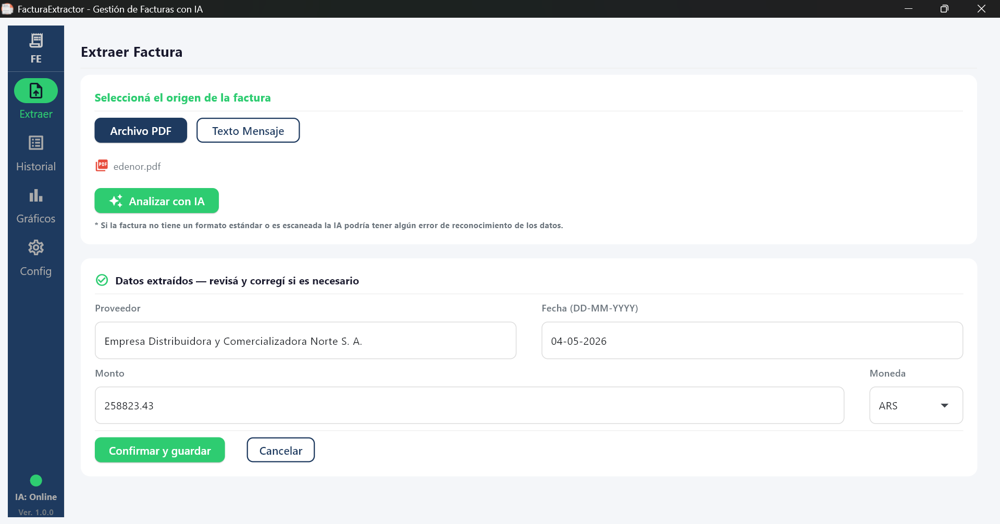
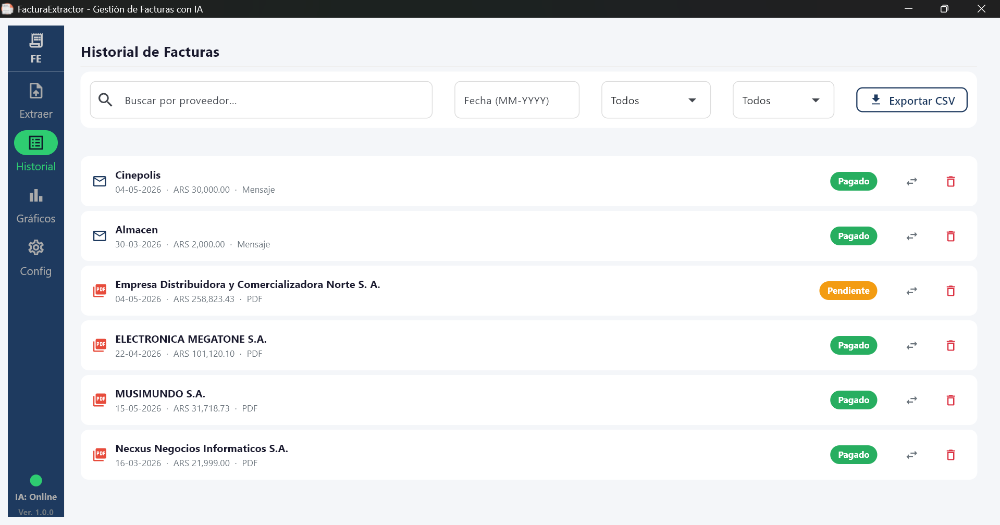
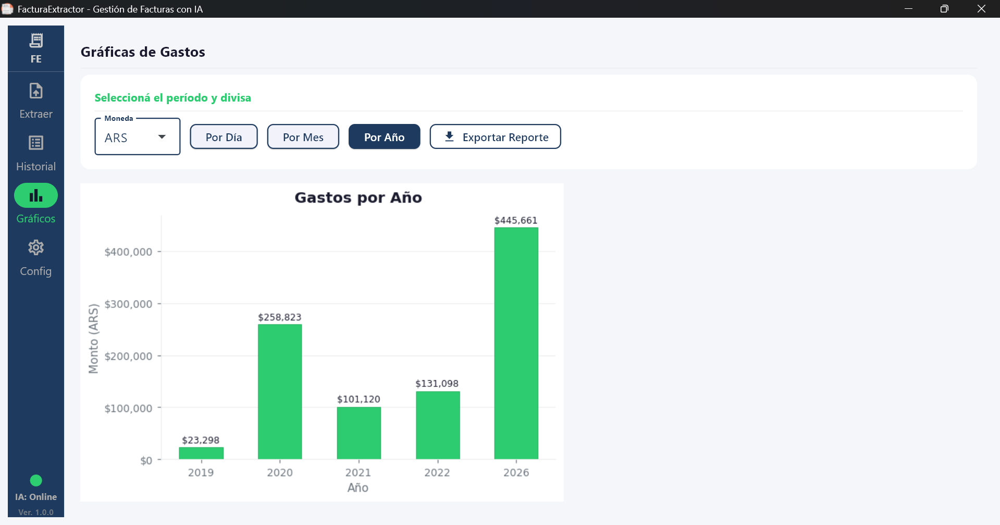
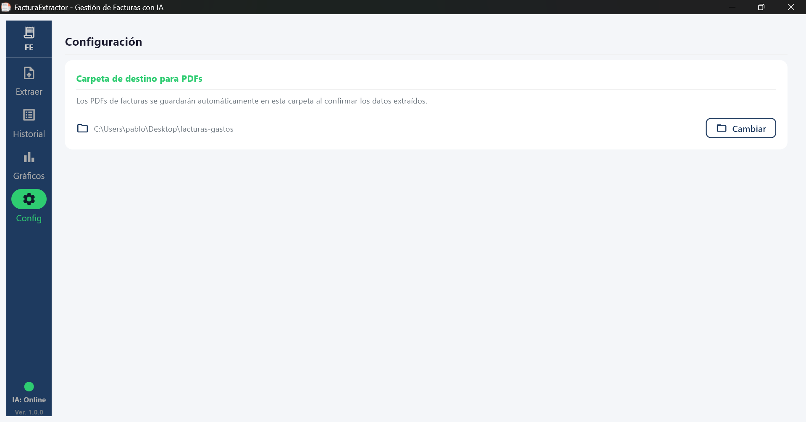

# FacturaExtractor AI

Aplicación de escritorio para Windows que extrae automáticamente los datos de facturas en PDF usando un modelo de IA local. Sin API keys, sin internet, sin que tus datos salgan de tu máquina.

<p align="center">
  <a href="https://github.com/PabloSalinasDev/FacturaExtractor-AI/releases">
    
  </a>
  &nbsp;&nbsp;&nbsp;&nbsp;
  <a href="https://github.com/PabloSalinasDev/FacturaExtractor-AI/issues">
    
  </a>
</p>

---

## Características

- **100% Local**: Usa `llama-cpp-python` para correr inferencia completamente offline a través de un servidor HTTP en segundo plano en `localhost:8080`.
- **Extracción inteligente**: Detecta automáticamente si el PDF es digital o escaneado y elige el método de lectura correcto.
- **OCR integrado**: Para facturas escaneadas usa EasyOCR con soporte para español e inglés.
- **Historial con base de datos**: Todas las facturas extraídas se guardan en una base de datos SQLite local.
- **Gráficos y reportes**: Visualización de gastos por proveedor, fecha y moneda con exportación a CSV.
- **Soporte multidivisa**: Detecta ARS, USD, EUR y BRL automáticamente.
- **Carpeta configurable**: Podés elegir dónde se guardan los PDFs renombrados automáticamente.
- **Base de datos local**: Todas las facturas se persisten en SQLite en `%LOCALAPPDATA%\FacturaExtractor\facturas.db`.
- **Sistema de logging**: Los errores y eventos se registran automáticamente en `%LOCALAPPDATA%\FacturaExtractor\logs\`.

---

## Cómo funciona

1. Al abrir la app, se descarga el modelo de IA si no se encuentra en el equipo, luego el modelo se carga en RAM en segundo plano, cuando termina se muestra con un indicador que ya se encuentra online.
2. Seleccionás un PDF de factura.
3. La app extrae el texto del PDF (nativo o via OCR si está escaneado).
4. El modelo extrae: **proveedor**, **fecha**, **monto** y **moneda**.
5. Confirmás o editás los datos extraídos.
6. La factura se guarda renombrada automáticamente con el formato `Proveedor_DD-MM-YYYY_MONEDAmonto.pdf`.
7. La app tiene un apartado donde se puede pegar el texto de una factura o escribir manualmente los gastos para que tambien quede guardado en el historial.
8. En el historial aparte de ver los datos extraídos, se puede marcar como pendiente o pagado.

---

## Capturas de pantalla


  
  
 
 

---

## Estructura del proyecto

```
FacturaExtractor/
├── assets/
│   ├── Extracción.png
│   ├── Gráficos.png
│   ├── Historial.png
│   └── icon.ico
├── config/
│   └── config_app.py       ← título, versión y AppUserModelID
├── db/
│   ├── crud.py             ← operaciones sobre la base de datos
│   └── database.py         ← inicialización de SQLite
├── modules/
│   ├── config.py           ← ruta del modelo, puerto del servidor
│   ├── csv_exporter.py     ← exportación de reportes a CSV
│   ├── file_manager.py     ← renombrado y guardado de PDFs
│   ├── llm_client.py       ← daemon del modelo y extracción con IA
│   └── reader.py           ← lectura de PDF (nativo + OCR)
├── views/
│   ├── charts_view.py      ← gráficos de gastos
│   ├── extractor_view.py   ← pantalla principal de extracción
│   ├── helpers.py          ← componentes y estilos compartidos
│   ├── history_view.py     ← historial de facturas
│   └── settings_view.py    ← configuración de carpeta destino
├── main.py                 ← punto de entrada, navegación, ciclo de vida
├── README.md
├── README.txt
└── pyproject.toml
```

---

## Instalación (Modo Desarrollo - Solo CPU)

```bash
# 1. Crear entorno virtual
python -m venv .venv
.venv\Scripts\activate
```

```bash
# 2. Instalar dependencias
pip install -e .
```

> La primera vez que abras la app descargará el modelo de IA (~0.92 GB). Esto ocurre una sola vez. El modelo se guarda en `%LOCALAPPDATA%\FacturaExtractor\models`.

---

## Rendimiento

La extracción corre 100% en CPU. El tiempo depende del hardware:

| Hardware | Tiempo estimado |
|----------|----------------|
| CPU moderno de escritorio (8+ núcleos) | ~5–10 segundos |
| Laptop / CPU más antiguo | ~10–16 segundos |
| PDFs escaneados (OCR) | 25–45 segundos adicionales |

---

## Requisitos

- Windows 10/11
- Python 3.10+
- ~1 GB de espacio en disco para el modelo

## Dependencias

| Paquete | Propósito |
|---------|-----------|
| flet | Interfaz gráfica de escritorio |
| llama-cpp-python | Modelo de IA local |
| httpx | Comunicación con el servidor del modelo |
| pdf_oxide | Extracción de texto de PDFs digitales |
| pypdfium2 | Renderizado de páginas para OCR |
| easyocr | OCR para PDFs escaneados |
| pillow | Procesamiento de imágenes |
| matplotlib | Gráficos de gastos |
| psutil | Gestión del proceso del daemon |

---

## Licencia

Este proyecto está licenciado bajo la Licencia MIT. Ver el archivo [LICENSE](LICENSE) para más detalles.

---

*Desarrollado por [Pablo Salinas](https://github.com/PabloSalinasDev)* - PyBloSoft © 2026